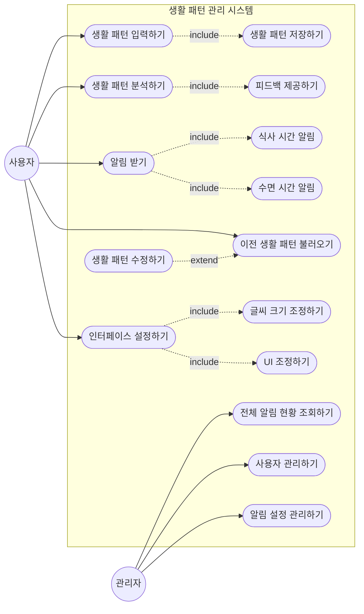
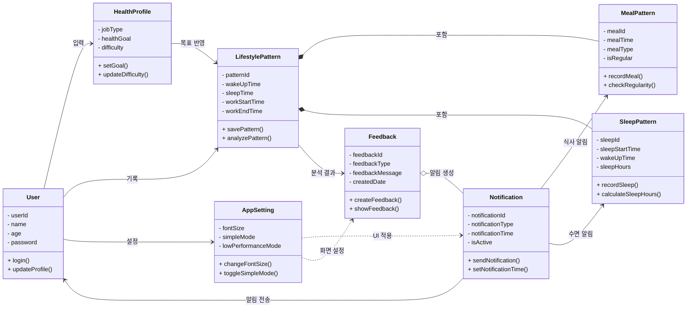

## 1. 프로젝트 개요

**프로젝트 명**
건강

**목적**
본 프로젝트는 사용자의 건강 정보와 생활 습관을 확인하고 피드백을 주는 시스템을 개발한다. 자신의 건강 상태와 생활 습관(식습관, 수면패턴)의 상태를 잘 알지 못하는 사람들에게 피드백을 주고 고칠 점을 알려주는 기능을 제공한다. 
사용자는 전 연령이 사용할 수 있게 할 것이며 현재 작성된 M2 보고서의 기능대로 프로그램을 만들것이다.

**예상 사용자**
건강을 피드백 받는 앱이기에 연령에 상관없이 나이대에 따른 건강 정보를 피드백할 수 있게 할 것이다.

**주요 기능 요약**
| # | 기능명 | 설명 |
|---|--------|------|
| 1 | 건강 정보 입력 | 사용자로부터 건강 정보를 입력 받는다. |
| 2 | 정보 피드백 | 사용자에게 입력 받은 정보로 고칠 점을 피드백한다. |
| 3 | 인터페이스 조정 | 전 연령이 사용하는 만큼 인터페이스 크기 조정을 사용자가 조절 할 수 있게 한다. |

## 2. 팀 구성 및 역할 분담
| 이름 | 역할 | 주요 담당 업무 |
|------|------|------|--------------|
| 주지훈 | PM | 보고서 작성, 깃허브 관리|
| 김예진 | 분석가 | 기능 요구 사항 분석 및 설계 / 유스케이스 다이어그램 제작 |
| 신현승 | 설계자 | 프로그램 코드 구조 설계 / 클래스 다이어그램 제작 |
| 조용익 | 개발자 | 유스케이스, 클래스 다이어그램을 기반한 프로그램 코드 제작 |
| 여서준 | QA/보안 | 프로그램 제작 피드백 및 테스트, cross 체크 담당 |

> 역할 변경 없음

## 3. 요구 사항 정의서 (최종본)

### 3-1. 3-1. 기능 요구사항 (FR)

| ID | 요구사항 내용 | 우선순위 | 상태 |
|----|--------------|---------|------|
| FR-01 | 사용자가 어떤 생활 패턴을 가지고 있는지 입력 하게하고 저장할 수 있게 한다. | 상 | 확정 |
| FR-02 | AI가 사용자의 생활 패턴을 분석하고 고쳐야할 것을 피드백 하여 알려줄 수 있게 해야 한다.| 상 | 확정 |
| FR-03 | 사용자의 생활 패턴을 저장하고 이후에 다시 불러올 수 있게 한다. | 중 | 확정 |
| FR-04 | 다양한 나이 대 사람이 사용할 수 있게 글씨 크기 조정이나 인터페이스를 조정할 수 있는 기능을 구현되어 있어야 한다. | 중상 | 확정 |
| FR-05 | 필요한 상황(식사시간, 수면 시간)에 알림이 가게 해야 한다. | 중하 | 확정 |

### 3-2. 비기능 요구사항 (NFR)

| ID | 품질 특성 | 요구사항 내용 | 우선순위 | 상태 |
|----|-----------|--------------|---------|------|
| NFR-01 | 성능 | 사용자가 생활 패턴을 입력 하였을 때 20초 이내로 패턴을 분석하고 피드백을 주어야 한다. | 상 | 확정 |
| NFR-02 | 보안 | 사용자의 개인 정보가 유출되지 않게 비밀번호 보안 강도를 강하게(특수문자, 영어 대문자 등) 설정할 수 있게 요청할 수 있어야 한다. | 상 | 확정 |

> 기능 요구 사항 변경 이력 없음.

## 4. WBS 및 프로젝트 일정

### 4-1. WBS 

| # | 단계 | 작업 항목 | 담당자 | 산출물 | 계획 주차 | 실제 완료 주차 | 상태 |
|---|------|-----------|--------|--------|-----------|--------------|------|
| 1 | 기획 | 팀 구성 및 역할 확정 | PM | 팀빌딩 결과서 | 4주 | 4주 | 완료 |
| 2 | 기획 | 요구사항 정의 | 분석가 | 요구사항 정의서 | 5주 | 6주  | 완료 |
| 3 | 기획 | WBS 및 간트 차트 | PM | WBS 문서 | 6주 | 6주 | 완료 |
| 4 | 기획 | 비용 산정 | 분석가 | 비용 산정표 | 7주 | 7주 | 완료 |
| 5 | 기획 | M1 기획서 통합 | PM | M1 기획서 | 8주 | 8주 | 완료 |
| 6 | 설계 | 협업 도구 설정 | 개발자 | 협업 도구 계획 | 8주 | 8주 | 완료 |
| 7 | 설계 | 유스케이스 다이어그램 | 분석가 | UC 다이어그램 | 9주 | 10주 | 완료 |
| 8 | 설계 | 클래스 다이어그램 | 설계자 | 클래스 다이어그램 | 10주 | 10주 | 완료 |
| 9 | 설계 | M2 설계 보고서 통합 | PM | M2 설계 보고서 | 12주 | 14주 | 완료 |
| 10 | 구현 | 핵심 로직 프로토타입 | 개발자 | 프로토타입 | 13주 | 14주 | 완료 |
| 11 | 검토 | 팀 내 Cross-check | QA/보안 | 인스펙션 결과표 | 14주 | 14주 | 완료 |
| 12 | 마무리 | 코딩 표준 문서 | 개발자 | 코딩 표준 | 14주 | 14주 | 완료 |
| 13 | 마무리 | AI 활용 내역 요약 | QA/보안 | AI 활용 요약 | 14주 | 15주 | 완료 |
| 14 | 마무리 | M3 최종 보고서 통합 | PM | M3 최종 보고서 | 15주 | 15주 | 완료 |

## 4-2. 계획 vs 실적 요약

| 항목 | 계획 대비 결과 | 주요 지연 원인 |
|------|--------------|--------------|
| 전체 일정 준수율 | 71% | 시험기간으로 인한 일정 변경 |
| 지연 발생 작업 수 | 4건 | // |
| 주요 지연 항목 | 부분적으로 지연 | // |

## 5. 비용 산정 결과

### 5-1. 최종 간이 FP 산정표

| 기능 유형 | 기능 목록 | 개수 | 가중치 | 소계 |
|-----------|-----------|------|--------|------|
| EI (외부 입력) | (로그인/회원가입), 건강상태 입력, 생활 습관 기록, 목표 설정 | 4 | 3 | 12 |
| EO (외부 출력) | (주/월간 건강 리포트 생성), 생활 습관 개선 알림, 위험 상태 경고 메시지 | 3 | 4 | 12 |
| EQ (외부 조회) | 실시간 건강 점수 조회, 과거 생활 습관 재조회, 추천 가이드라인 조회 | 3 | 3 | 9 |
| ILF (내부 논리 파일) | 사용자 프로필 정보, 건강상태기록 DB, 수면 및 식습관 로그 DB | 3 | 7 | 21 |
| EIF (외부 인터페이스 파일) | 공공 건강 데이터 API연동, 외부 건강앱 | 2 | 5 | 10 |
| **합계** | 64FP |

### 5-2. 공수 산정 결과

| 항목 | 내용 |
|------|------|
| 총 FP | 64FP |
| 적용 생산성 | 64FP/12인월 |
| 예상 개발 기간 | 5.33인월 |
| 팀 인원 기준 | 1.066개월 |

> M1대비 변경 이력 없음.

### 6-1. 사용 도구 목록

| 도구 | 용도 | 운영 방식 |
|------|------|-----------|
| 카카오톡 | 연락 및 프로젝트 정보 전달 | 깃허브에 프로젝트 진행 사항을 업로드하고 팀원들이 확인하고 수정할 사항을 피드백 받는다 |

### 6-2. 실제 운영 결과

**잘 활용된 점**
팀원이 깃허브 커밋 사항을 확인하고 수정 사항을 피드백해준다.

**운영 중 발생한 문제 및 해결 방법**
수정 사항이 활발히 들어오지 않아 커밋 횟수가 부족했었음. 

## 7. UML 다이어그램 (최종본)

**M2 대비 변경 사항**
변경없음

### 7-2. 클래스 다이어그램

**M2 대비 변경 사항**
변경없음

## 8. 인스펙션 결과 (팀 내 Cross-check)

### 8-1. 검토 개요

| 항목 | 내용 |
|------|------|
| 검토 일시 | 6/19 |
| 검토 방식 | 팀 내 역할 교환 (분석가↔개발자, 설계자↔QA/보안 등) |
| 검토 산출물 | M3 보고서에 작성 |
| 검토 참여 인원 | 팀원 전체 |

### 8-2. 역할별 교차 검토 결과

| 검토 방향 | 검토자 | 검토 항목 | 발견된 결함 | 심각도 | 수정 여부 |
|-----------|--------|-----------|------------|--------|-----------|
| 분석가 산출물 → | 개발자 | 유스케이스 다이어그램 | 액터 부분 | 중 | 수정 / 미수정 / 부분 수정 |
| 설계자 산출물 → | QA/보안 | 클래스 다이어그램 | 메서드 부족 | 중상 | 메서드 추가 및 변수 수정 |
| 개발자 산출물 → | 분석가 | 프로그램 코드 | - | 하 | |
| QA/보안 산출물 → | 설계자 | - | - | 하 | |

### 8-3. 검토 결과 반영 요약

| # | 검토 항목 | 지적 내용 | 반영 여부 | 비고 |
|---|-----------|-----------|-----------|------|
| 1 | 클래스 다이어그램 | 메서드 부족 | 반영 | |
| 2 | 유스케이스 다이어그램 | 액터와 기능 연결 부정확 | 반영 | |
| 3 | | | | |

## 9. 코딩 표준 문서

9. 코딩 표준 문서
항목	적용 기준
명명 규칙 — 클래스	PascalCase를 사용한다. 예: User, HealthProfile, SleepPattern, LifestylePattern
명명 규칙 — 메서드·변수	Python 코드 기준으로 snake_case를 사용한다. 예: load_data, save_data, record_sleep, sleep_hours, meal_type
명명 규칙 — 상수	UPPER_SNAKE_CASE를 사용한다. 예: DATA_FILE
들여쓰기	스페이스 4칸을 사용한다. 탭은 사용하지 않는다.
주석 규칙	코드 구역을 나눌 때는 # ── 사용자 ──, # ── 수면 패턴 ──처럼 역할이 드러나도록 작성한다. 단순한 코드에는 불필요한 주석을 달지 않고, Observer 패턴이나 저장 로직처럼 이해가 필요한 부분에만 주석을 작성한다.
파일 구조	현재는 health_manager.py 한 파일에 주요 기능을 구현한다. 데이터 저장 파일은 같은 폴더의 health_data.json을 사용한다. 추후 기능이 커질 경우 사용자, 생활패턴, 피드백, 알림 기능을 별도 파일로 분리할 수 있다.
AI 생성 코드 표기	AI가 생성한 코드 블록에는 반드시 AI 생성 코드임을 표시한다. Python 코드에서는 주석 문법에 맞게 # AI-generated를 사용한다. 단, 보고서 작성 가이드에서 // AI-generated를 요구하는 경우 문서에는 해당 기준도 함께 명시한다.
기타	함수와 메서드에는 가능한 한 타입 힌트를 작성한다. 예: def analyze_pattern(self) -> dict:. 비밀번호와 같이 외부에 직접 노출되면 안 되는 값은 __password처럼 비공개 속성으로 관리한다.

## 10. AI 활용 내역 요약

### 10-1. 팀 전체 AI 활용 현황

| 항목 | 내용 |
|------|------|
| 총 활용 횟수 (추정) | 5회 |
| 주요 사용 도구 | chat GPT |
| 가장 많이 활용한 단계 | 다이어그램 제작, 보고서 작성 |

### 10-2. 단계별 활용 내역

| 단계 | 주요 활용 내용 | 활용 도구 | 팀 수정 여부 |
|------|--------------|-----------|------------|
| 기획 (M1) | 기능 요구 사항 아이디어 수집 | chat GPT | 현재 프로젝트에 맞는 기능인지 검사 후 사용 |
| 설계 (M2) | 다이어그램 내용 검사 및 다이어그램 틀 제작 | chat GPT | 유스케이스와 클래스 다이어그램의 기능적 연결이 되어있는지 확인 |
| 구현·검토 (M3) | - | - | - |

### 10-3. AI 활용 3원칙 준수 자체 평가

| 원칙 | 준수 여부 | 비고 |
|------|-----------|------|
| 단순 복사 금지 | 부분 준수 | |
| 비판적 검증 | 준수 | |
| 수정 이력 명시 | 준수 | |

### 10-4. 가장 효과적이었던 AI 활용 사례

유스케이스 제작과 클래스 다이어그램 제작 때 가장 많이 사용되었습니다. 기능 요구 사항과 클래스 다이어그램에서 요구사항에 따른 클래스 분류를 어떻게 사용해야할지 몰라 AI의 도움을 받아 클래스를 나눌 수 있었습니다.

### 10-5. AI 활용의 한계 또는 주의가 필요했던 사례

유스케이스 작성 때 액터와 기능을 어떻게 연결 지을지 몰라 AI에게 질문하였는데 목표로 했던 생각과 달라 주의를 써가며 AI를 사용하였습니다.

## 11. 회고 및 개선 사항

### 11-1. 팀 전체 회고

**잘된 점**

(작성)

**아쉬운 점**

(작성)

**배운 점**

(작성)

**다음에 다시 한다면**

(작성)

### 11-2. 팀원별 소감

| 이름 | 역할 | 한 줄 소감 |
|------|------|-----------|
| | PM | |
| | 분석가 | |
| | 설계자 | |
| | 개발자 | |
| | QA/보안 | |
