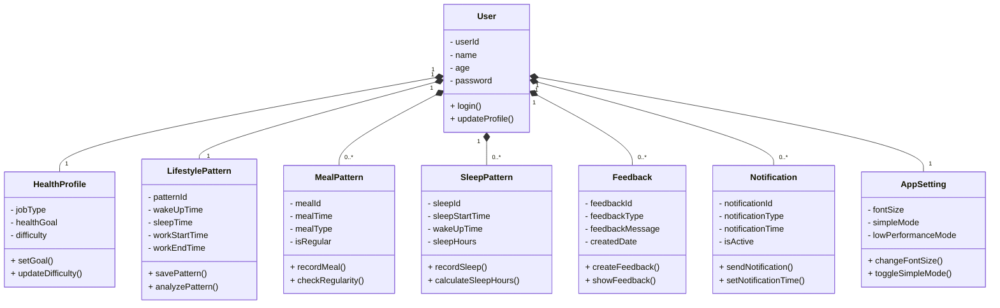

```mermaid
classDiagram

class User {
  - userId
  - name
  - age
  - password
  + login()
  + updateProfile()
}

class HealthProfile {
  - jobType
  - healthGoal
  - difficulty
  + setGoal()
  + updateDifficulty()
}

class LifestylePattern {
  - patternId
  - wakeUpTime
  - sleepTime
  - workStartTime
  - workEndTime
  + savePattern()
  + analyzePattern()
}

class MealPattern {
  - mealId
  - mealTime
  - mealType
  - isRegular
  + recordMeal()
  + checkRegularity()
}

class SleepPattern {
  - sleepId
  - sleepStartTime
  - wakeUpTime
  - sleepHours
  + recordSleep()
  + calculateSleepHours()
}

class Feedback {
  - feedbackId
  - feedbackType
  - feedbackMessage
  - createdDate
  + createFeedback()
  + showFeedback()
}

class Notification {
  - notificationId
  - notificationType
  - notificationTime
  - isActive
  + sendNotification()
  + setNotificationTime()
}

class AppSetting {
  - fontSize
  - simpleMode
  - lowPerformanceMode
  + changeFontSize()
  + toggleSimpleMode()
}

User "1" *-- "1" HealthProfile
User "1" *-- "1" LifestylePattern
User "1" *-- "0..*" MealPattern
User "1" *-- "0..*" SleepPattern
User "1" *-- "0..*" Feedback
User "1" *-- "0..*" Notification
User "1" *-- "1" AppSetting
```
