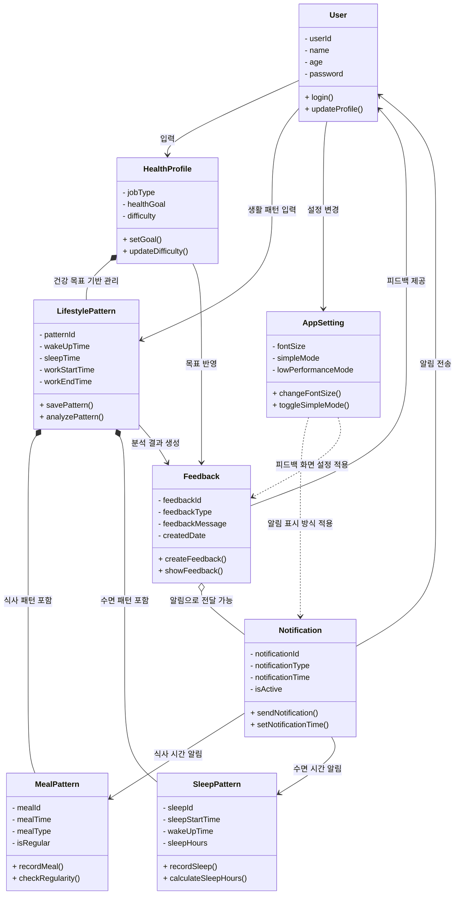

```mermaid
classDiagram

class User {
  - userId
  - name
  - age
  - password
  + login()
  + updateProfile()
}

class HealthProfile {
  - jobType
  - healthGoal
  - difficulty
  + setGoal()
  + updateDifficulty()
}

class LifestylePattern {
  - patternId
  - wakeUpTime
  - sleepTime
  - workStartTime
  - workEndTime
  + savePattern()
  + analyzePattern()
}

class MealPattern {
  - mealId
  - mealTime
  - mealType
  - isRegular
  + recordMeal()
  + checkRegularity()
}

class SleepPattern {
  - sleepId
  - sleepStartTime
  - wakeUpTime
  - sleepHours
  + recordSleep()
  + calculateSleepHours()
}

class Feedback {
  - feedbackId
  - feedbackType
  - feedbackMessage
  - createdDate
  + createFeedback()
  + showFeedback()
}

class Notification {
  - notificationId
  - notificationType
  - notificationTime
  - isActive
  + sendNotification()
  + setNotificationTime()
}

class AppSetting {
  - fontSize
  - simpleMode
  - lowPerformanceMode
  + changeFontSize()
  + toggleSimpleMode()
}

User --> HealthProfile : 입력
User --> LifestylePattern : 생활 패턴 입력
User --> AppSetting : 설정 변경

HealthProfile *-- LifestylePattern : 건강 목표 기반 관리
LifestylePattern *-- MealPattern : 식사 패턴 포함
LifestylePattern *-- SleepPattern : 수면 패턴 포함

LifestylePattern --> Feedback : 분석 결과 생성
HealthProfile --> Feedback : 목표 반영

Feedback --> User : 피드백 제공
Feedback o-- Notification : 알림으로 전달 가능

Notification --> User : 알림 전송
Notification --> MealPattern : 식사 시간 알림
Notification --> SleepPattern : 수면 시간 알림

AppSetting ..> Notification : 알림 표시 방식 적용
AppSetting ..> Feedback : 피드백 화면 설정 적용
```
