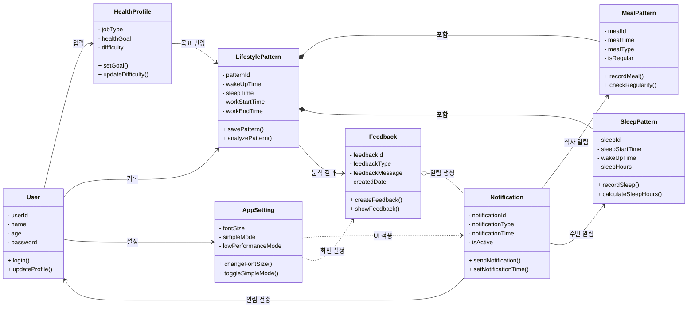

```mermaid
classDiagram
direction LR

class User {
  - userId
  - name
  - age
  - password
  + login()
  + updateProfile()
}

class HealthProfile {
  - jobType
  - healthGoal
  - difficulty
  + setGoal()
  + updateDifficulty()
}

class LifestylePattern {
  - patternId
  - wakeUpTime
  - sleepTime
  - workStartTime
  - workEndTime
  + savePattern()
  + analyzePattern()
}

class MealPattern {
  - mealId
  - mealTime
  - mealType
  - isRegular
  + recordMeal()
  + checkRegularity()
}

class SleepPattern {
  - sleepId
  - sleepStartTime
  - wakeUpTime
  - sleepHours
  + recordSleep()
  + calculateSleepHours()
}

class Feedback {
  - feedbackId
  - feedbackType
  - feedbackMessage
  - createdDate
  + createFeedback()
  + showFeedback()
}

class Notification {
  - notificationId
  - notificationType
  - notificationTime
  - isActive
  + sendNotification()
  + setNotificationTime()
}

class AppSetting {
  - fontSize
  - simpleMode
  - lowPerformanceMode
  + changeFontSize()
  + toggleSimpleMode()
}

%% 사용자 입력 관계
User --> HealthProfile : 입력
User --> LifestylePattern : 기록
User --> AppSetting : 설정

%% 생활 패턴 중심 관계
LifestylePattern *-- MealPattern : 포함
LifestylePattern *-- SleepPattern : 포함

%% 분석 및 피드백 관계
HealthProfile --> LifestylePattern : 목표 반영
LifestylePattern --> Feedback : 분석 결과

%% 알림 관계
Feedback o-- Notification : 알림 생성
Notification --> User : 알림 전송

%% 알림 세부 관계
Notification --> MealPattern : 식사 알림
Notification --> SleepPattern : 수면 알림

%% 설정 적용 관계
AppSetting ..> Notification : UI 적용
AppSetting ..> Feedback : 화면 설정
```
