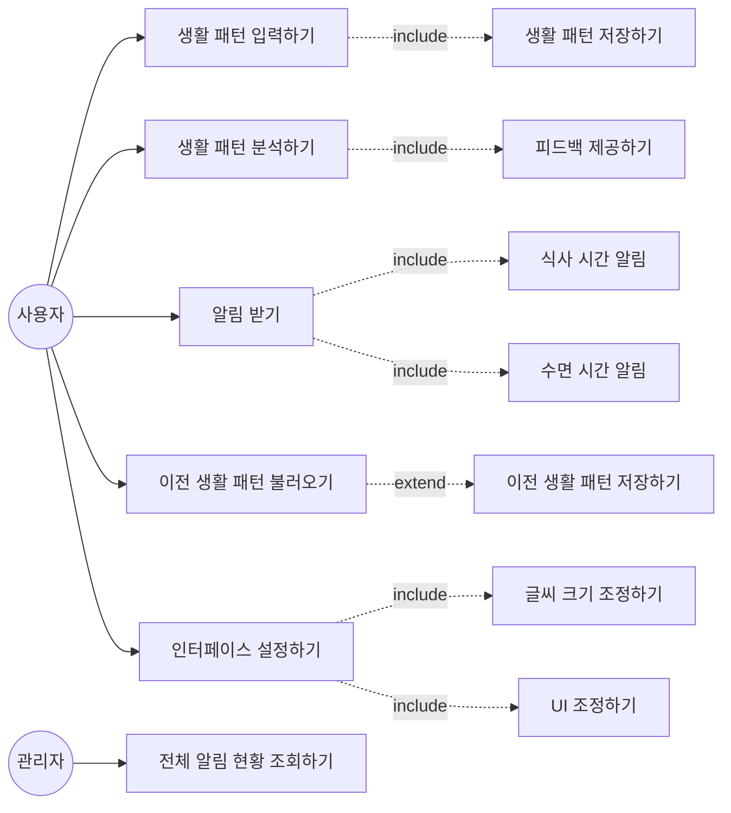

```mermaid
flowchart LR

User((사용자))
Admin((관리자))

A[생활 패턴 입력하기]
B[생활 패턴 저장하기]

C[생활 패턴 분석하기]
D[피드백 제공하기]

E[알림 받기]
F[식사 시간 알림]
G[수면 시간 알림]

H[이전 생활 패턴 불러오기]
I[이전 생활 패턴 저장하기]

J[인터페이스 설정하기]
K[글씨 크기 조정하기]
L[UI 조정하기]

M[전체 알림 현황 조회하기]

User --> A
User --> C
User --> E
User --> H
User --> J

Admin --> M

A -. include .-> B
C -. include .-> D

E -. include .-> F
E -. include .-> G

H -. extend .-> I

J -. include .-> K
J -. include .-> L
```
